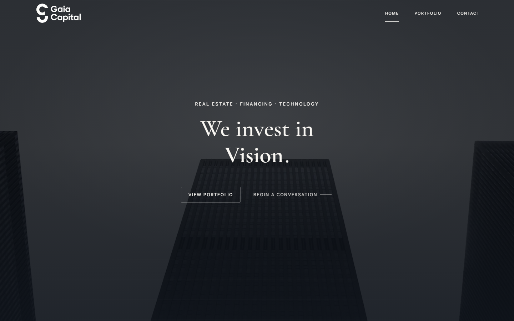
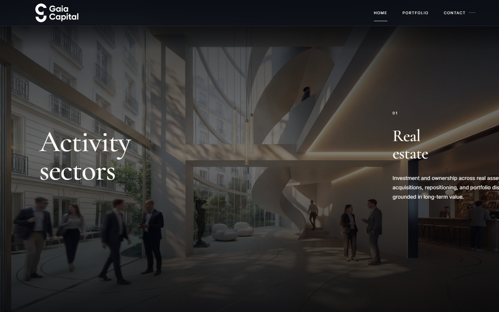
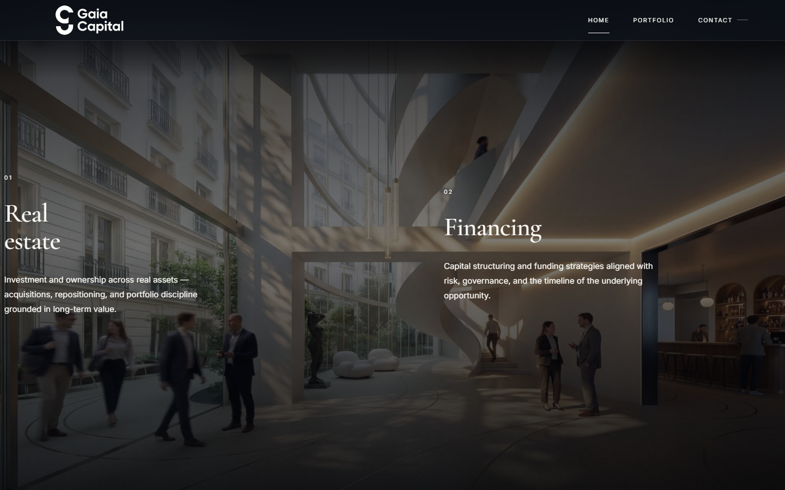
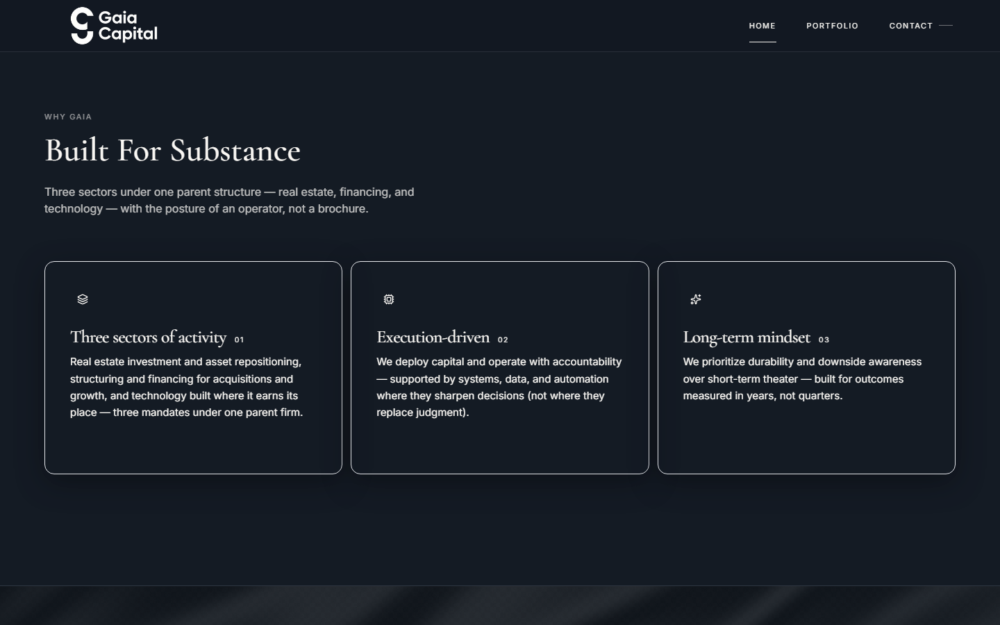
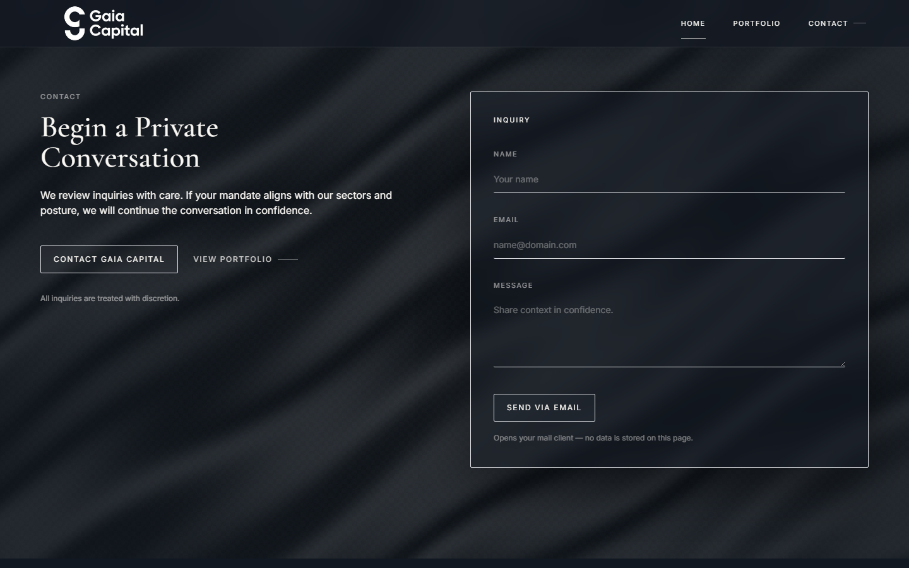
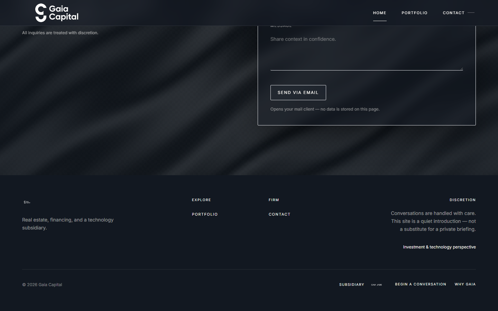
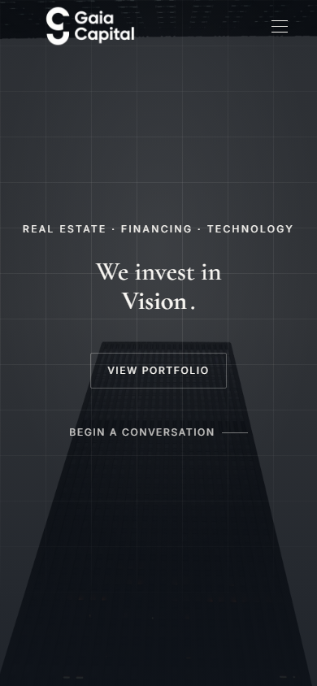
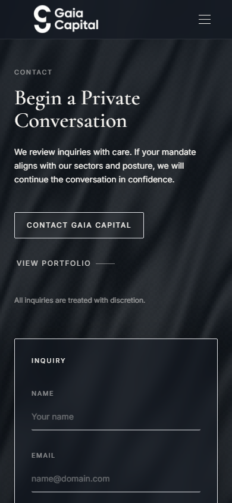

# Landing visuals — screenshot map for Stitch

Screenshots live in **`docs/stitch/screenshots/`**. Regenerate them anytime so Stitch and stakeholders see **current production UI**, not drifted mocks.

## Runbook (local)

1. **Production build** (closest to deployed visuals):

   ```bash
   npm run build
   ```

2. **Start the server** on a free port (use **3002** if **3000** is already taken by another app):

   ```bash
   npm run start -- -p 3002
   ```

3. **Capture** (requires devDependency `playwright`; first run may download Chromium):

   ```bash
   npm run capture:stitch
   ```

   If the server is not on port 3000, set the origin first:

   ```powershell
   $env:STITCH_BASE_URL='http://127.0.0.1:3002'; npm run capture:stitch
   ```

   On macOS/Linux:

   ```bash
   STITCH_BASE_URL=http://127.0.0.1:3002 npm run capture:stitch
   ```

   The script checks reachability with an **8 second** timeout so a stuck or non-HTTP process on the port fails fast instead of hanging.

**Timing**: The home route shows a **full-screen intro** (~2s+). The capture script waits for the hero headline (“We invest in”) before shooting so frames match the post-intro experience.

## Desktop — 1440×900 (viewport)

| File | What it shows |
|------|----------------|
| `01-hero-desktop.png` | Hero: eyebrow, headline + rotated word, CTAs, background treatment |
| `02-positioning-start-desktop.png` | Start of horizontal positioning strip (first panel area) |
| `03-positioning-mid-desktop.png` | Mid-scrub: second/third panel territory (scroll-linked) |
| `04-why-gaia-desktop.png` | “Why Gaia” header + bento row |
| `05-contact-desktop.png` | Contact narrative + inquiry panel |
| `06-footer-desktop.png` | Footer: tagline, links, discretion, Labs row |

## Mobile — 390×844

| File | What it shows |
|------|----------------|
| `07-hero-mobile.png` | Hero stacked layout |
| `08-contact-mobile.png` | Contact section stacked |

## Embedded previews

If the files above exist, they render below.

### Desktop













### Mobile





## Using these in Google Stitch

1. Upload **desktop** set first to establish hierarchy and spacing.
2. Add **mobile** pair to constrain responsive behavior.
3. Keep `LANDING_DESIGN.md` open for tokens and type rules while iterating.

If screenshots are missing, run the capture script once and commit the PNGs so this file’s image links resolve in GitHub / VS Code preview.
